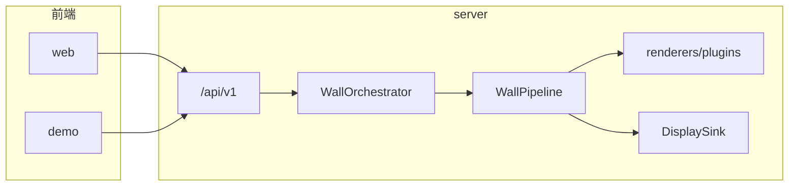

# MyPi

面向树莓派等设备的**电子画框**：多组「场景」按间隔或周历触发，经渲染管线上屏；**Web 控制台**（`web/`）负责配置与即时预览，`demo/` 偏展示与实验 UI。**契约真源**：后端 Pydantic 模型与 `/api/v1` JSON，demo 的布局与 mock 数据不作 API 契约。

## 术语（与代码/JSON 对齐）

| 中文 | 标识 | 说明 |
|------|------|------|
| 场景 | `scene` | 一张卡片：`templateId`、`templateParams`、`schedule`、是否启用等 |
| 内容模板 | `templateId` | 对应某个 `WallTemplatePlugin`，由插件注册表白名单 |
| 画框调校 | `frameTuning` | 全局图像参数 |
| 设备配置 | `deviceProfile` | 屏参等 |
| 上屏编排 | `WallOrchestrator` | 合并下次触发时刻、排序、与「立即上屏」共用执行路径 |
| 上屏记录 | `wallRun` | 追加写入 `wall_runs.jsonl` |
| 上屏状态 | `wallState` | 当前屏预览 URL、`upcoming[]` 等只读视图 |

## 技术栈

| 层级 | 选型 |
|------|------|
| 后端 | Python 3.11+，Flask 3，Pydantic v2，APScheduler，Pillow |
| 前端 | Vite + React + TypeScript，`fetch`；与 DTO 对齐后端 JSON |
| 进程模型 | 开发：`npm run dev` + Vite 将 `/api` 代理到后端（默认 `5050`）。生产推荐 **gunicorn 1 worker** + venv + systemd；可与计划一致，由 **Flask 同端口托管前端构建产物**（静态目录 + `/api/v1`），减少多进程与反向代理配置 |
| 数据 | `server/data/` 下 JSON / jsonl，**无数据库** |

## 整体架构

1. 各 `scene` 自带 `interval` 或 `cron_weekly`（`weekdays` 与 JS 一致：**0 = 周日**）。
2. **编排器**合并「到期」场景，按 **`tieBreakPriority` 再 `id`** 稳定排序，与 **立即上屏** 一并进入队列；**DisplaySink 单通道**（互斥），忙则顺序排队。
3. 执行路径：**插件 `render`** →（管线中的画框调校等）→ **DisplaySink**；结果与错误写入 **wallRun**。

## 调度器与 APScheduler

| 组件 | 职责 |
|------|------|
| **`orchestrator/`** | 业务与时间线**真源**：读 `config` 与 `schedule_state.json`，用 **`next_fire_time` / `global_min_next`** 算各启用场景的下一触发时刻；`wakeup` 内将到期场景与 `show-now` 排队，**同一路径**调用管线；成功后更新 **`lastShownAtBySceneId`**；**`GET /wall/state` 的 `upcoming[]`** 与调度使用**同一套** `next_fire_time`，避免 UI 与真实触发漂移 |
| **APScheduler** | **仅闹钟**：维护 **单个** job（`wall_alarm`），在全局最早触发时刻 `t_min` 调用 `wakeup()`；**不为每个场景各挂一个 job**，便于配置热更新后统一 **reschedule** |
| **兜底** | 若算不出任何未来 `t_min`，则使用 **约 1 小时** 的 interval 触发一次自检，避免进程长期不唤醒 |

配置变更（如 **`PUT /config`**、**`PUT /scenes/{id}`**）后会 **`wakeup()`**，重算并重排该单 job。调度器在 **`create_app()`** 中与 Flask 同进程启动（见 `app/factory.py`）；**gunicorn 多 worker 时每个 worker 会各有一份调度器**，生产请用 **1 worker** 或另行约定单例部署。

## `server` 暴露的 HTTP 接口

前缀：**`/api/v1`**。

| 方法 | 路径 | 说明 |
|------|------|------|
| `GET` | `/config` | 读取全局配置 |
| `PUT` | `/config` | 写入全局配置并触发编排 `wakeup` |
| `GET` | `/templates` | 已注册模板列表，每项 `templateId`、`displayName` |
| `GET` | `/scenes` | 场景列表 |
| `POST` | `/scenes` | **当前实现返回 409**：场景由插件驱动，一行对应一个已安装模板，非任意新建 |
| `GET` | `/scenes/{id}` | 单条场景 |
| `PUT` | `/scenes/{id}` | 更新场景（**不可改 `templateId`**）；保存后 `wakeup` |
| `DELETE` | `/scenes/{id}` | **当前实现返回 400**：不能删除插件卡片；需移除插件并重启 |
| `POST` | `/scenes/{id}/show-now` | 立即上屏（禁用场景会 400）；响应含最新 `wallState` |
| `GET` | `/wall/state` | `wallState`（含 `upcoming`） |
| `GET` | `/wall/runs` | 上屏记录：自 `wall_runs.jsonl` **取最近至多 50 条**，新在前（非完整分页） |
| `GET` | `/output/{run_id}/{filename}` | 提供 `data/output/` 下已渲染 **PNG**（供 ``）；`run_id` 为 UUID，`filename` 受限 |

实现入口：**`server/api/v1_routes.py`**。

## 数据与持久化（`server/data/`）

| 文件 | 作用 |
|------|------|
| `config.json` | 应用与场景配置 |
| `schedule_state.json` | 每场景 **`lastShownAtBySceneId`**，供 `interval` 等计算下一跳 |
| `wall_runs.jsonl` | 每次上屏尝试一行 JSON，作审计与排查 |
| `output/{run_id}/` | 本轮渲染产出图片 |

具体字段形状见 **`server/domain/models.py`** 与 API 返回；`scene` 含 `schedule`（`interval` / `cron_weekly`）、`templateParams` 自由 JSON 对象等。

## 如何新增渲染插件

1. 在 **`server/renderers/plugins/`** 新增模块（例如 `my_template.py`）。
2. 实现 **`WallTemplatePlugin`**（**`renderers/plugin_base.py`**）子类，并提供：
   - 类属性 **`template_id`**：全局唯一，与场景 `templateId` 一致；
   - 类属性 **`display_name`**：给人看的名称，出现在 **`GET /templates`**；
   - **`render(self, ctx: RenderContext) -> RenderResult`**：从 **`ctx.scene.template_params`** 读参数，校验与默认在插件内完成；写出文件后返回 **`RenderResult(image_path="绝对路径")`**。
3. 也可在模块级提供 **`plugin`** 单例，逻辑同上。
4. 启动时 **`discover_plugins()`** 扫描包内模块；**重复的 `template_id` 会直接启动失败**。
5. **重启服务**后新插件出现在 `/templates`；场景行仍由「安装了哪些插件」决定，前端对 **`templateParams`** 使用通用 JSON 编辑即可。

## 仓库目录

| 路径 | 说明 |
|------|------|
| **`server/`** | 后端：Flask、`api/`、`domain/`、`orchestrator/`、`pipeline/`、`renderers/`、`display/`、`storage/`、`data/`。入口 **`app/factory.py`**，生产 **`wsgi.py`** |
| **`web/`** | 正式控制台 |
| **`demo/`** | 画框演示；**`legacy-static/`** 为旧版静态 |
| **`.cursor/`** | 编辑器规则与 Agent 技能 |

启动命令、**`FLASK_DEBUG` 双进程陷阱**、**`MYPI_TZ`** 等见 **[server/README.md](server/README.md)**。

## 快速开始

1. **后端**：`cd server`，`PYTHONPATH` 设为当前目录，执行 `python app/factory.py`（默认 `5050`）。本地联调若开 `FLASK_DEBUG=1`，建议改用 **`python _dev_serve.py`** 单进程。
2. **前端**：在 `web` 或 `demo` 下 `npm install` && `npm run dev`。
3. 冒烟：**`server/verify_demo.py`** 等可在正确 `PYTHONPATH` 下运行。
