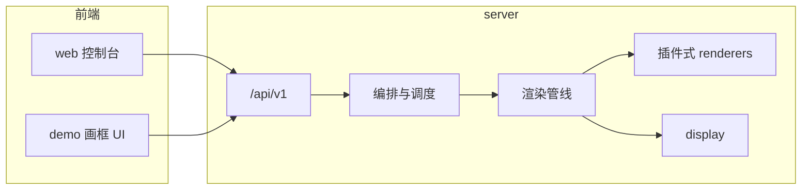

# MyPi

面向树莓派等设备的**电子画框**：按日程把多组「场景」渲染成静态画面并**上墙**展示，同时提供 Web 控制台做配置与即时预览。

## 整体架构

后端 **Flask** 暴露 `/api/v1`，负责读写配置、驱动 **APScheduler** 与 **WallOrchestrator**，经 **WallPipeline** 调用 **renderers** 插件生成帧，再由 **display** 层输出到实际屏幕；产物与运行记录落在 `server/data/`。  
**web** 与 **demo** 为 **Vite + React** 前端，开发时将 `/api` 代理到本机 `5050`，与后端约定同一套 REST 接口。

## 目录说明

**`server/`**  
Python 单体服务入口在 `app/factory.py`（`wsgi.py` 供生产挂载）。`api/v1_routes.py` 提供配置、场景、模板元数据、上墙状态、渲染产物访问等接口；`domain` / `storage` 承载模型与持久化；`orchestrator` 串行化唤醒与「立即上墙」；`pipeline` 与 `renderers/plugins` 负责具体画幅生成。详细启动方式、调试注意点与环境变量见 [server/README.md](server/README.md)。

**`web/`**  
正式管理界面：编辑场景参数、查看墙上状态、触发即时上墙等，与生产环境对齐。

**`demo/`**  
偏展示与实验的电子画框前端；`legacy-static/` 保留早期纯静态资源，便于对照。

**`.cursor/`**  
编辑器侧规则与 Agent 技能，与运行时无关。

## 快速开始

1. **后端**：进入 `server/`，设置 `PYTHONPATH` 为当前目录后运行 `python app/factory.py`（默认 `5050`）。本地若开启 `FLASK_DEBUG=1` 联调预览，建议改用单进程 `python _dev_serve.py`，避免双进程导致状态不一致（说明见 server README）。
2. **前端**：在 `web/` 或 `demo/` 执行 `npm install` 与 `npm run dev`，浏览器访问 Vite 提示的本地地址即可通过代理访问 API。

仓库内另有 `verify_*.py` 等脚本，可用于接口或调度行为的冒烟检查（在 `server/` 目录、正确 `PYTHONPATH` 下执行）。

## 若本地仍有空的 `pi-server/` 目录

后端目录已改名为 **`server/`**，Git 里不再包含 `pi-server`。若在资源管理器里仍看到**空的** `pi-server`，多半是某程序仍占用该路径（例如曾把终端 `cd` 进过该目录、Cursor 多根工作区里仍挂着旧文件夹）。

处理方式：

1. 关掉所有**当前工作目录**在 `MyPi\pi-server` 下的终端窗口。
2. 在 Cursor / VS Code 中：若工作区是「多文件夹」，从工作区里**移除** `pi-server` 这一项；或完全关闭编辑器后再开，只打开仓库根目录 `MyPi`。
3. 在资源管理器中**手动删除** `pi-server` 文件夹；或在新的 PowerShell 里执行：  
   `Remove-Item -LiteralPath "C:\Users\xiewr\Documents\MyPi\pi-server" -Recurse -Force`  
   （请按你的实际路径替换。）

删除后只保留 `server/`、`web/`、`demo/` 即可。根目录 `.gitignore` 已忽略 `pi-server/`，避免误把残留目录再提交进仓库。
